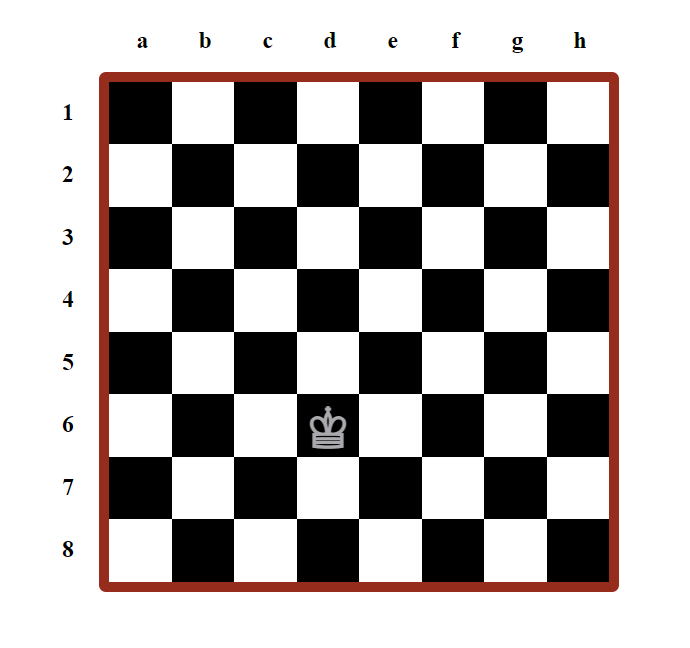

# Chessboard HTML, CSS, and JavaScript Implementation Description

This implementation showcases a chessboard created using HTML and JavaScript. It features dynamic generation of chessboard blocks and labels, as well as an interactive hovering effect that displays a rhombus.

## Acknowledgements
I would like to express my gratitude to the ITI internship program for providing me with the opportunity to work on this task and enhance my React skills.

## Chess Board Overview

## Other ITI ReactJs Internship related Tasks

- Simulatingthe interface of google meet using ReactJS: [Google-Meet-Interface](https://github.com/AhmedMaherElSaeidi/Google-Meet-Interface)
